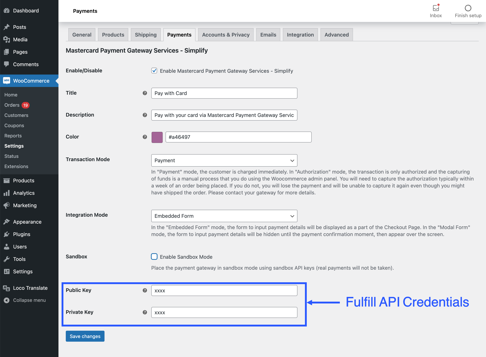

# Simplify Commerce Payment Gateway for WooCommerce

The Simplify Commerce payment gateway plugin for WooCommerce 7.6+ lets you to take card payments directly on your WooCommerce store.

&nbsp;&nbsp;

## Overview Section
<a href="https://www.mastercard.co.in/en-in.html" target="_blank">Mastercard Inc.</a> is the second-largest payment-processing corporation worldwide. It offers a range of payment transaction processing and other related payment services. By connecting individuals, businesses, and organizations in more than 210 countries and territories today, we're unlocking opportunities for more people in more places for generations. This WooCommerce module adds different payment methods to the WooCommerce checkout, enabling credit and debit card payments to be accepted securely on your WooCommerce-powered website. 

Payments through this module are processed securely via the Mastercard Payment Gateway. This ensures that card data is managed in compliance with all legal requirements. The gateway monitors every transaction and handles sensitive payment data on PCI Level 1 certified servers, simplifying PCI compliance for your business.

## Support

For any issues or enhancement requests you have with this plugin, please raise them with the bank's support team. Please make sure you also provide your plugin, woocommerce and wordpress version as well as your merchant ID where applicable. This will help to speed up the troubleshooting of any issues you are having.

## Getting Started 

* Get your API keys from your merchant dashboard in your Account Settings - API Keys.
* Follow the plugin installation instructions below 
* You're ready to take payments in your WooCommerce store!

## Installation

**Minimum Requirements**

* WooCommerce 7.6 or greater
* PHP version 7.4 or greater
* cURL

## Compatibility
The module has been tested with the WooCommerce versions:

- 7.6.1 
- 7.7.2
- 7.8.0
- 7.9.0
- 8.0.1
- 8.1.1
- 8.2.1
- 8.3.0
- 8.4.1
- 8.5.2
- 8.7.1
- 8.0.0
- 9.0.2
- 9.1.4

The module has been tested with the WordPress versions:

- 5.2.4
- 5.3.2
- 5.6.0
- 5.7.2
- 5.9.1
- 6.0.3
- 6.1.2
- 6.2.2
- 6.3.1
- 6.4.2
- 6.5.2
- 6.6.1

## Documentation
The official documentation for this module is available on: [https://mpgs.fingent.wiki/simplify-commerce/simplify-commerce-payment-gateway-for-woocommerce/getting-started/](https://mpgs.fingent.wiki/simplify-commerce/simplify-commerce-payment-gateway-for-woocommerce/getting-started/)

## Support
For customer support:[https://mpgsfgs.atlassian.net/servicedesk/customer/portals](https://mpgsfgs.atlassian.net/servicedesk/customer/portals/)

### Steps 
1. Download the latest plugin zip file from [this link](https://github.com/simplifycom/woocommerce-simplify-payment-gateway-plugin/releases/latest).

2. Add New Plugin
   
   
3. Upload zip file
  
   
4. Activate Plugin
   
   
5. Plugin Settings 
   
   
6. Enter API Keys and other settings
   
   
## Why choose Simplify Commerce?

With Simplify Commerce, you can easily integrate online payments from most major card brands and start selling right away. Our powerful dashboard and features, including e-invoices and recurring payments, make it easy to immediately meet your needs.

Choose Simplify Commerce as your WooCommerce payment gateway to get access to your money quickly with a powerful, secured payment engine supplied by Mastercard.

## Frequently Asked Questions

### Does this support recurring payments, like for subscriptions?
Yes!

### Does this support both production mode and sandbox mode for testing?
Yes it does - production and sandbox mode is driven by the API keys you use.

### License
This software is Open Source, released under the Apache License 2.0. See [LICENSE.txt](LICENSE.txt) for more info.
